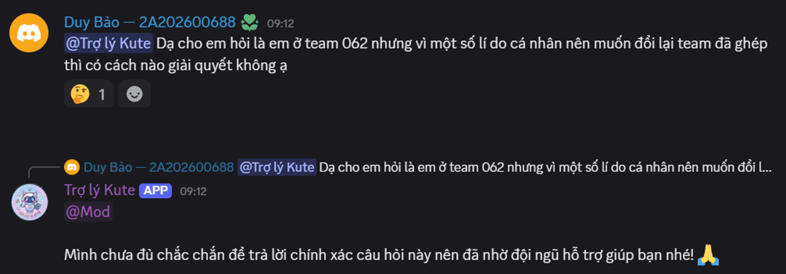
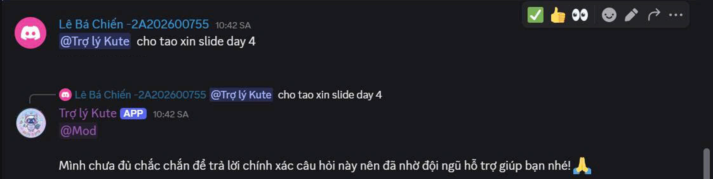

# SPEC sản phẩm: Chatbot Kuter - Giải pháp hỗ trợ học tập và vận hành VinAI Thực chiến

## 1. Bằng chứng (Evidence)

Nỗi đau của người dùng (học viên và ứng viên) được quan sát và ghi nhận trực tiếp từ thực tế vận hành lớp học:

### Trải nghiệm trực tiếp (Self-use)
Khi thành viên nhóm trải nghiệm chatbot hiện tại (**Trợ lý Kute**), bot gặp lỗi không thể giải đáp các thắc mắc về quy trình vận hành linh hoạt.
* **Chi tiết quan sát:** Thành viên Duy Bảo hỏi cách xử lý khi muốn đổi nhóm đã được ghép:
  * *Học viên hỏi:* "@Trợ lý Kute Dạ cho em hỏi là em ở team 062 nhưng vì một số lí do cá nhân nên muốn đổi lại team đã ghép thì có cách nào giải quyết không ạ"
  * *Bot phản hồi:* "@Mod Mình chưa đủ chắc chắn để trả lời chính xác câu hỏi này nên đã nhờ đội ngũ hỗ trợ giúp bạn nhé! 🙏"
* **Ảnh chụp màn hình:**
  
* **Những chỗ thấy vướng (Friction points):**
  * **Thiếu hụt tri thức động:** Câu hỏi về việc đổi nhóm này thực chất đã từng được hỏi và có câu trả lời/hướng dẫn cụ thể từ admin/mentor trên Discord trước đó. Tuy nhiên, Trợ lý Kute hoàn toàn không có kiến thức này do chỉ được trang bị thông tin tĩnh từ Handbook PDF.
  * Bot lập tức đầu hàng và tag Mod khi gặp câu hỏi thực tế phát sinh, buộc học viên phải đợi ban tổ chức phản hồi thủ công, làm chậm tiến độ làm việc nhóm.

### Nguồn từ bên ngoài nhóm
Quan sát hành vi của các học viên khác trong lớp khi tương tác với chatbot hiện tại.
* **Chi tiết quan sát:** Học viên Lê Bá Chiến hỏi xin tài liệu học tập:
  * *Học viên hỏi:* "@Trợ lý Kute cho tao xin slide day 4"
  * *Bot phản hồi:* "@Mod Mình chưa đủ chắc chắn để trả lời chính xác câu hỏi này nên đã nhờ đội ngũ hỗ trợ giúp bạn nhé! 🙏"
* **Ảnh chụp màn hình:**
  
* **Những chỗ thấy vướng (Friction points):**
  * **Thiếu đồng bộ tài nguyên:** Link slide các buổi học (trong đó có slide Day 4) đã được hỏi trên Discord. Tuy nhiên, chatbot cũ vẫn không thể tự truy cập hay trả lời được do không cập nhật dữ liệu Q&A Discord.
  * Gây quá tải tin nhắn trên kênh chung.

---

## 2. Lát cắt để build (Build slice)

Cho học viên và ứng viên VinAI Thực chiến đang cần câu trả lời hành chính hoặc tài nguyên học tập, **Kuter** sẽ dùng AI RAG kết hợp đa nguồn để:
1. **Automate** trả lời chính xác các câu hỏi FAQ hành chính dựa trên Handbook PDF (kèm trích dẫn số trang).
2. **Augment** câu trả lời cho các câu hỏi vận hành và kỹ thuật bằng cách trích xuất, tổng hợp từ lịch sử hỏi đáp (Discord Q&A) đã được phê duyệt trong Rule-base (rulebase.json) và hiển thị kèm tag **`[Rule-base]`**.
3. **Fallback** an toàn bằng cách tự động ghi nhận câu hỏi chưa giải quyết (ghi log `new_issue.json` cục bộ) trên Discord, đồng thời trả về câu thoại hướng dẫn người dùng liên hệ Mentor trên Discord (với Web) hoặc hướng dẫn Mentor dùng tính năng **Reply** của Discord để bổ sung tri thức tức thì (với Discord bot).

---

## 3. AI Product Canvas

| Ô | Nội dung chi tiết |
|---|---|
| **Value** — Giá trị | - **Đối tượng:** Học viên và ứng viên VinAI Thực chiến. - **Nỗi đau:** Trợ lý Kute cũ chỉ trả lời từ Handbook tĩnh, không cập nhật được Q&A vận hành và tài nguyên trên Discord. - **AI giải quyết:** RAG tích hợp Handbook tĩnh và Q&A Discord động giúp học viên tự giải quyết vấn đề ngay lập tức. |
| **Trust** — Niềm tin | - **Nhận diện sai:** Người dùng dễ dàng nhận diện nhờ tag phân loại nguồn rõ ràng (`🗂 Rule-base`, `📄 Handbook`, `⚠️ Ngoài phạm vi`) đi kèm câu trả lời. - **Xử lý sai:** Mentor có thể sửa sai hoặc bổ sung trực tiếp bằng cách dùng tính năng **Reply** của Discord trên tin nhắn của học viên hoặc tin nhắn fallback của bot. |
| **Feasibility** — Tính khả thi | - **Dữ liệu cần có:** Handbook PDF chính thức và lịch sử Q&A trên Discord đã được làm sạch. - **Rủi ro lớn nhất:** AI hallucinate ra giải pháp kỹ thuật/thủ tục sai lệch gây bối rối cho học viên. - **Ngưỡng dừng:** Nếu độ tin cậy của câu trả lời thấp (cosine similarity < 0.78 hoặc không tìm thấy thông tin phù hợp), bot tự động chuyển luồng sang fallback, log issue chờ Mentor hỗ trợ. |
| **Tín hiệu học** | Khi Mentor reply câu hỏi chưa giải quyết trên Discord, bot tự động sinh 5 câu paraphrase bằng Gemini 2.5 Flash để lưu cùng câu trả lời của Mentor vào `rulebase.json`, đồng thời tự động cập nhật cache embedding tức thì trên cả Web và Discord. |

---

## 4. Tăng năng lực hay tự động hóa (Augment vs Automate)

* **Conditional Automation (Tự động hóa có điều kiện):**
  * *Tự động hóa hoàn toàn (Automate):* Đối với các câu hỏi hành chính rõ ràng có sẵn nguồn trong Handbook (như điều kiện tham gia, lịch trình chung).
  * *Tăng năng lực con người (Augment):* Đối với các câu hỏi vận hành phức tạp hoặc lỗi kỹ thuật. Kuter chỉ tổng hợp lịch sử Discord làm gợi ý nháp để học viên tham khảo tự sửa lỗi, không tự ý đưa ra quyết định thay cho con người.
  * *Lý do chọn:* Giảm thiểu rủi ro AI đưa ra hướng dẫn kỹ thuật sai lệch làm học viên nản lòng, đồng thời giảm tải tối đa cho Mentor khỏi những câu hỏi lặp đi lặp lại.

---

## 5. Bốn đường đi của trải nghiệm (Four paths)

| Đường đi | Kịch bản trải nghiệm |
|---|---|
| **Đường thuận** | Học viên hỏi "Điều kiện tham gia lớp là gì?" -> Kuter truy xuất Handbook và trả lời chính xác kèm số trang trích dẫn. |
| **Khi AI không chắc** | Học viên hỏi câu hỏi vận hành đã có trên Discord -> Kuter truy xuất dữ liệu từ Rule-base và hiển thị câu trả lời kèm tag **`[Rule-base]`**. |
| **Khi AI sai (Ngoài phạm vi)** | Bot/Web trả về câu trả lời ngoài phạm vi (fallback). Trên Discord, câu hỏi tự động được ghi vào `new_issue.json` chờ Mentor. Trên Web, hướng dẫn người dùng liên hệ Mentor trên Discord. |
| **Khi người dùng sửa** | Mentor dùng tính năng Reply trên Discord để trả lời -> Hệ thống tự động paraphrase câu hỏi, lưu Q&A mới vào `rulebase.json` và reload cache tức thì. |

---

## 6. Những kiểu lỗi đáng lo nhất

1. **Hallucination thông tin hành chính/quy định:**
   * *Khi nào xảy ra:* Khi quy định thay đổi đột ngột hoặc dữ liệu Handbook bị chồng chéo.
   * *Hậu quả:* Học viên nhận thông tin sai về deadline hoặc cách tính điểm, dẫn đến mất điểm hoặc vi phạm nội quy.
   * *Cách xử lý:* Luôn đính kèm citation số trang gốc của Handbook và cập nhật cơ sở dữ liệu ngay khi có thông báo mới.
2. **Gợi ý code/lỗi kỹ thuật sai:**
   * *Khi nào xảy ra:* Khi lỗi của học viên quá mới hoặc lịch sử Discord chứa thông tin nhiễu.
   * *Hậu quả:* Học viên chạy code lỗi nghiêm trọng hơn, gây ức chế.
   * *Cách xử lý:* Gắn nguồn trích dẫn hoặc tag **`[Rule-base]`**, tự động log câu hỏi không có câu trả lời rõ ràng vào `new_issue.json` để Mentor kiểm duyệt trên Discord.

---

## 7. Kế hoạch kiểm thử và bằng chứng demo

* **Kịch bản kiểm thử Happy Path:**
  * *Đầu vào:* "Xin thông tin về điều kiện nhận chứng chỉ và số trang Handbook nói về điều này."
  * *Kỳ vọng:* Kuter trả lời rõ ràng kèm trích dẫn số trang chính xác.
* **Kịch bản kiểm thử Low-Confidence / Fallback Path:**
  * *Đầu vào:* "Lỗi đổi nhóm sau khi đã ghép cặp giải quyết thế nào?" hoặc "Lấy slide bài giảng Day 4 ở đâu?"
  * *Kỳ vọng:* Kuter trích xuất câu trả lời đã có trên Discord, hiển thị tag **`[Rule-base]`**. Nếu không tìm thấy, trả về câu thoại fallback hướng dẫn qua Discord và log câu hỏi vào `new_issue.json`.
* **Kịch bản kiểm thử Dynamic Update Path (Tự học):**
  * *Đầu vào:* Mentor Reply vào tin nhắn ngoài phạm vi trên Discord -> Bot phản hồi xác nhận lưu thành công 6 biến thể câu hỏi (gốc + 5 paraphrase) và tự động cập nhật tri thức.
  * *Kỳ vọng:* Web reload cache và trả lời được ngay câu hỏi đó ở lượt sau với tag **`[Rule-base]`**.

---

## 8. Phân công

*(Chưa phân công cụ thể - Sẽ cập nhật sau)*
